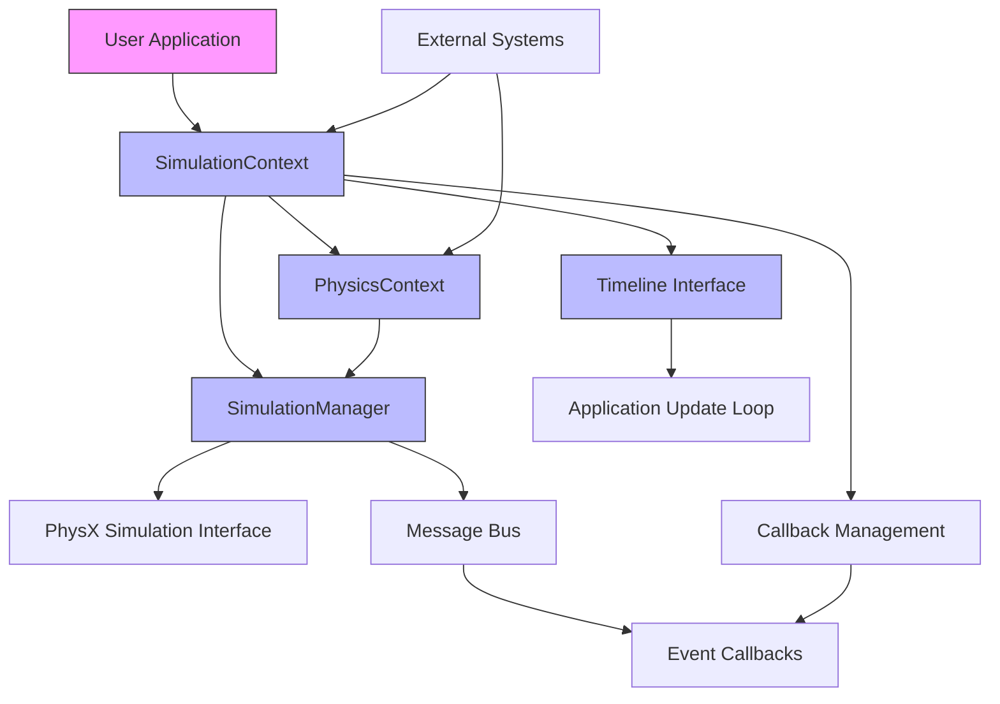
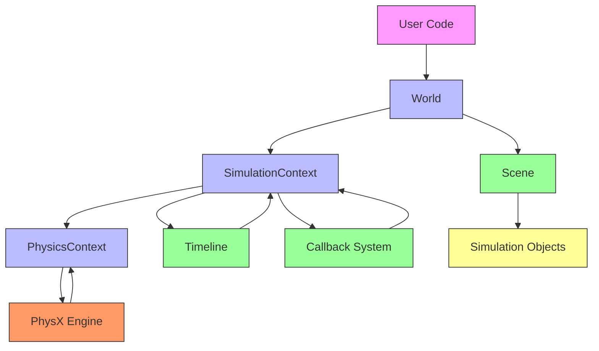

# Simulation Context

<!-- Auto-generated Table of Contents -->
- [Overview](#overview)
- [Core Architecture](#core-architecture)
- [Singleton Pattern Implementation](#singleton-pattern-implementation)
- [Component Integration](#component-integration)
- [Timeline and Callback Management](#timeline-and-callback-management)
- [Physics Context Integration](#physics-context-integration)
- [Usage Examples](#usage-examples)

## Overview

The SimulationContext is the central coordinator for simulation timing and callbacks in Isaac Sim. It implements the singleton pattern, ensuring that only one instance exists throughout the application. This singleton nature allows for global access to simulation state and timing information, managing the simulation loop and invoking registered callbacks at appropriate intervals.

The SimulationContext serves as the primary interface for users while delegating physics-specific operations to the PhysicsContext and low-level simulation management to the SimulationManager. It integrates with Omniverse's timeline system to control simulation playback and uses event-driven callbacks to notify subscribers of important simulation events.

## Core Architecture

The SimulationContext follows a layered architecture with clear separation between simulation management, physics configuration, and entity control:

```mermaid
classDiagram
    class SimulationContext {
        +_instance : SimulationContext
        +_physics_context : PhysicsContext  
        +_timeline_interface : Timeline
        +_app_interface : AppInterface
        +initialize()
        +step(current_time : float)
        +reset()
        +play()
        +pause()
        +stop()
        +add_physics_callback()
        +add_stage_callback()
        +add_timeline_callback()
        +add_render_callback()
        +get_physics_context()
        +get_timeline()
        +clear_instance()
        +set_simulation_dt()
        +set_rendering_dt()
        +get_physics_dt()
        +get_rendering_dt()
        +is_playing()
        +is_stopped()
        +current_time()
    }
    
    class PhysicsContext {
        +set_physics_dt(dt : float)
        +get_physics_dt() : float
        +enable_gpu_dynamics(flag : bool)
        +enable_ccd(flag : bool)
        +set_broadphase_type(broadcast_type : str) None
        +set_solver_type(solver_type : str) None
        +set_gravity(value : float) None
        +_step(current_time : float) None
    }
    
    class World {
        +_world_initialized : bool
        +_task_scene_built : bool
        +_current_tasks : dict
        +_scene : Scene
        +_data_logger : DataLogger
        +__init__(physics_dt, rendering_dt, stage_units_in_meters, physics_prim_path, sim_params, set_defaults, backend, device)
        +add_task(task : BaseTask) None
        +reset() None
    }
    
    class Scene {
        +_objects : dict
        +_object_names : dict
        +__init__()
        +add(object, name : str) None
        +get_object(name : str) Optional[object]
    }
    
    SimulationContext --> PhysicsContext : "contains"
    World --> SimulationContext : "inherits"
    World --> Scene : "contains"
    SimulationContext --> "Callback Functions" : "manages"
    PhysicsContext --> "PhysX Interface" : "uses"
```

### System Components

At the foundation is the SimulationContext class, which provides the basic infrastructure for managing simulation time, rendering, and event callbacks. Building upon this foundation, the PhysicsContext class handles physics-specific configuration such as gravity, solver settings, and collision detection parameters.

The World class extends SimulationContext to add task management and scene organization capabilities, serving as the primary interface for most simulation scenarios. The controller and robot classes provide higher-level abstractions for manipulating articulated entities within the simulation.

## Singleton Pattern Implementation

The SimulationContext implements a singleton pattern to ensure only one instance exists throughout the application lifecycle. This design prevents conflicts in simulation state management and provides a consistent interface for accessing simulation controls.

```python
def __new__(cls, *args, **kwargs) -> SimulationContext:
    """Makes the class a singleton.

    Returns:
        SimulationContext: The instance of the simulation context.
    """
    if SimulationContext._instance is None:
        SimulationContext._instance = super(SimulationContext, cls).__new__(cls)
    else:
        carb.log_info("Simulation Context is defined already, returning the previously defined one")
    return SimulationContext._instance
```

### Instance Management Methods

The singleton pattern is implemented through the `__new__` method, which checks if an instance already exists in the class variable `_instance`. The class also provides class methods for instance management:

- **`instance()`** - Returns the current instance or None if not instantiated
- **`clear_instance()`** - Destroys the current instance and resets the class variable
- **Access Control** - Ensures thread-safe access to the singleton instance

```python
@classmethod
def instance(cls) -> Optional[SimulationContext]:
    """Returns the current SimulationContext instance.
    
    Returns:
        SimulationContext: Current instance or None if not created.
    """
    return cls._instance

@classmethod  
def clear_instance(cls) -> None:
    """Clears the current SimulationContext instance."""
    if cls._instance is not None:
        cls._instance = None
        carb.log_info("SimulationContext instance cleared")
```

## Component Integration

### Architecture Overview
The architecture follows a layered pattern where higher-level components delegate to lower-level systems for specific functionality:



### Initialization Process
The class initialization process sets up various interfaces and configurations:

```python
def __init__(self, physics_dt=1.0/60.0, rendering_dt=1.0/60.0, stage_units_in_meters=1.0, 
             physics_prim_path="/physicsScene", sim_params=None, set_defaults=True, 
             backend="numpy", device=None):
    """Initialize SimulationContext with configuration parameters.
    
    Args:
        physics_dt: Physics time step in seconds
        rendering_dt: Rendering time step in seconds  
        stage_units_in_meters: Stage unit conversion factor
        physics_prim_path: USD path for physics scene
        sim_params: Physics simulation parameters
        set_defaults: Whether to set default physics parameters
        backend: Physics backend ("numpy" or "torch")
        device: Compute device for operations
    """
    # Initialize core interfaces
    self._app_interface = omni.kit.app.get_app_interface()
    self._extension_manager = omni.kit.app.get_app().get_extension_manager()
    self._framework = carb.get_framework()
    self._timeline_interface = omni.timeline.get_timeline_interface()
    
    # Initialize callback systems
    self._physics_callbacks = {}
    self._stage_callbacks = {}  
    self._timeline_callbacks = {}
    self._render_callbacks = {}
    
    # Setup physics context
    self._physics_context = PhysicsContext(
        physics_dt=physics_dt,
        prim_path=physics_prim_path,
        sim_params=sim_params,
        set_defaults=set_defaults,
        backend=backend,
        device=device
    )
```

## Timeline and Callback Management

### Timeline Integration
The SimulationContext integrates with Omniverse's timeline system for simulation playback control:

```python
def play(self) -> None:
    """Start simulation playback."""
    if not self._timeline_interface.is_playing():
        self._timeline_interface.play()

def pause(self) -> None:  
    """Pause simulation playback."""
    if self._timeline_interface.is_playing():
        self._timeline_interface.pause()

def stop(self) -> None:
    """Stop simulation and reset to start."""
    if self._timeline_interface.is_playing() or self._timeline_interface.is_paused():
        self._timeline_interface.stop()

def current_time(self) -> float:
    """Get current simulation time.
    
    Returns:
        float: Current simulation time in seconds.
    """
    return self._timeline_interface.get_current_time()
```

### Callback System
The callback system enables event-driven programming and reactive simulation control:

#### Physics Step Callbacks
```python
def add_physics_callback(self, callback_name: str, callback_fn: Callable) -> None:
    """Register callback for physics step events.
    
    Args:
        callback_name: Unique identifier for the callback
        callback_fn: Function to call during physics steps
    """
    self._physics_callbacks[callback_name] = callback_fn

def remove_physics_callback(self, callback_name: str) -> None:
    """Remove registered physics callback.
    
    Args:
        callback_name: Name of callback to remove
    """
    if callback_name in self._physics_callbacks:
        del self._physics_callbacks[callback_name]
```

#### Render Callbacks  
```python
def add_render_callback(self, callback_name: str, callback_fn: Callable) -> None:
    """Register callback for render events.
    
    Args:
        callback_name: Unique identifier for the callback
        callback_fn: Function to call during rendering
    """
    self._render_callbacks[callback_name] = callback_fn
```

#### Timeline Event Callbacks
```python
def add_timeline_callback(self, callback_name: str, callback_fn: Callable) -> None:
    """Register callback for timeline events.
    
    Args:
        callback_name: Unique identifier for the callback
        callback_fn: Function to call on timeline changes
    """
    self._timeline_callbacks[callback_name] = callback_fn
```

## Physics Context Integration

### Relationship with PhysicsContext
The World class (which inherits from SimulationContext) integrates closely with PhysicsContext:

```python
def get_physics_context(self) -> PhysicsContext:
    """Access the physics context for physics-specific operations.
    
    Returns:
        PhysicsContext: The physics context instance.
    """
    return self._physics_context

def set_physics_dt(self, dt: float) -> None:
    """Set physics time step.
    
    Args:
        dt: Time step in seconds.
    """
    self._physics_context.set_physics_dt(dt)

def get_physics_dt(self) -> float:
    """Get current physics time step.
    
    Returns:
        float: Physics time step in seconds.
    """
    return self._physics_context.get_physics_dt()
```

### Scene Integration
The World class contains a Scene object for managing simulation entities:

```python
def __init__(self, ...) -> None:
    # ...
    self._scene = Scene()
    # ...

def get_scene(self) -> Scene:
    """Access the scene for object management.
    
    Returns:
        Scene: The scene instance.
    """
    return self._scene
```

### Component Interaction Flow


This architecture creates clear separation of concerns:
- **World** - High-level simulation organization and task management
- **SimulationContext** - Simulation timing, callbacks, and coordination
- **PhysicsContext** - Physics-specific configuration and parameters
- **Scene** - Entity management and spatial organization

## Usage Examples

### Basic SimulationContext Usage
```python
from isaacsim.core.utils import SimulationContext

# Create simulation context (singleton)
simulation_context = SimulationContext(
    physics_dt=1.0/60.0,  # 60 FPS physics
    rendering_dt=1.0/60.0  # 60 FPS rendering
)

# Start simulation
simulation_context.play()

# Step simulation manually
current_time = simulation_context.current_time()
simulation_context.step(current_time + simulation_context.get_physics_dt())

# Access physics context
physics_context = simulation_context.get_physics_context()
physics_context.set_gravity(-9.81)
```

### World-Based Usage (Recommended)
```python
from isaacsim.core import World

# Create world (includes SimulationContext)
world = World(
    physics_dt=1.0/120.0,  # High-frequency physics
    rendering_dt=1.0/60.0,  # Standard rendering
)

# Access simulation context through world
simulation_context = world.get_context()
physics_context = world.get_physics_context()

# World provides higher-level interface
world.reset()  # Reset entire simulation
world.step(render=True)  # Step with rendering
```

### Callback Registration
```python
def physics_step_callback(step_size):
    """Called on each physics step."""
    print(f"Physics step: {step_size}")

def render_callback():
    """Called on each render frame.""" 
    print("Render frame")

# Register callbacks
simulation_context.add_physics_callback("my_physics", physics_step_callback)
simulation_context.add_render_callback("my_render", render_callback)

# Callbacks will be invoked automatically during simulation
simulation_context.play()
```

### Advanced Configuration
```python
# Create with custom physics parameters
from isaacsim.core.utils.physics import SimulationParams

sim_params = SimulationParams()
sim_params.use_gpu_dynamics = True
sim_params.broadphase_type = "GPU"
sim_params.solver_type = "TGS"

simulation_context = SimulationContext(
    physics_dt=1.0/240.0,  # High-frequency physics
    sim_params=sim_params,
    backend="torch",  # Use PyTorch backend
    device="cuda:0"  # Specify GPU device
)

# Configure physics context
physics_context = simulation_context.get_physics_context()
physics_context.enable_gpu_dynamics(True)
physics_context.enable_ccd(True)  # Continuous collision detection
```

---

**Referenced Files:**
- [simulation_context.py](../../source/extensions/isaacsim.core.api/python/impl/simulation_context/simulation_context.py) - Core implementation
- [physics_context.py](../../source/extensions/isaacsim.core.api/python/impl/physics_context/physics_context.py) - Physics integration  
- [world.py](../../source/extensions/isaacsim.core.api/python/impl/world/world.py) - World class implementation

**Related Topics:**
- [World Management](world-management.md)
- [Physics Context](physics-context.md)
- [Scene Organization](scene-organization.md)