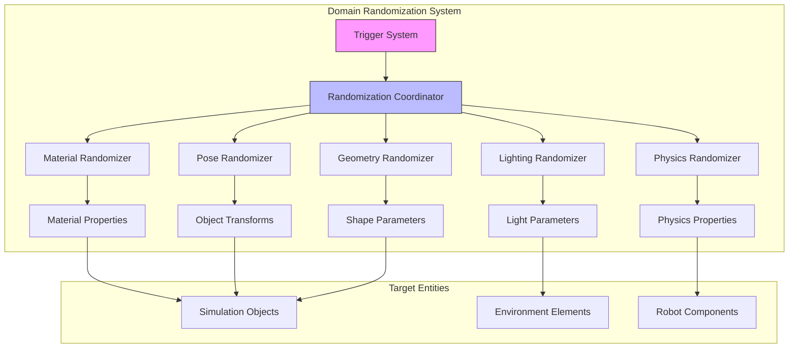

# Domain Randomization

<!-- Auto-generated Table of Contents -->
- [Introduction](#introduction)
- [Domain Randomization Architecture](#domain-randomization-architecture)
- [Randomization Techniques](#randomization-techniques)
- [Implementation Details](#implementation-details)
- [Usage Examples](#usage-examples)
- [Best Practices](#best-practices)

## Introduction

Domain randomization is a crucial technique for creating diverse and robust synthetic datasets in Isaac Sim. The system provides several methods for introducing variation in the synthetic environment to improve model generalization. This technique introduces controlled variations in simulation parameters to bridge the gap between synthetic and real-world data, enabling models trained on synthetic data to perform effectively in real environments.

The domain randomization extension (`isaacsim.replicator.domain_randomization`) provides specialized nodes for randomizing physics properties, object poses, and environmental conditions. These nodes are implemented as OGN (Omniverse Graph Nodes) that can be integrated into larger simulation graphs.

## Domain Randomization Architecture

The domain randomization system follows a node-based graph architecture where randomization operations are constructed by connecting various nodes that represent different types of parameter variations.



### System Components

The domain randomization implementation exposes a comprehensive set of attributes that can be randomized across different simulation entities:

#### Simulation Context Attributes
- **gravity** - Randomization of gravitational acceleration vector
- **physics_dt** - Physics time step variations
- **solver_settings** - Physics solver parameter modifications

#### Rigid Prim Attributes  
- **angular_velocity**, **linear_velocity**, **velocity** - Kinematic state randomization
- **mass**, **density** - Physical property variation  
- **material_properties** - Surface characteristic modification
- **collision_properties** - Contact behavior randomization

#### Articulation Attributes
- **stiffness**, **damping**, **joint_friction** - Joint dynamics randomization
- **joint_positions**, **joint_velocities** - Articulated state variation
- **lower_dof_limits**, **upper_dof_limits** - Joint range modification
- **max_efforts**, **joint_armatures** - Actuation capability variation
- **body_masses**, **body_inertias** - Link physical properties
- **tendon_stiffnesses**, **tendon_dampings** - Tendon-driven mechanism parameters

## Randomization Techniques

### Material Randomization
Material properties can be randomized to simulate different surface appearances and physical characteristics:

#### Metallic Properties
Randomized between 0.0 and 1.0 to simulate various material types from matte to metallic surfaces:

```python
def randomize_materials(prim_path_regex):
    prims = rep.get.prims(path_pattern=prim_path_regex)
    mats = rep.create.material_omnipbr(
        metallic=rep.distribution.uniform(0.0, 1.0),
        roughness=rep.distribution.uniform(0.0, 1.0),
        diffuse=rep.distribution.uniform((0, 0, 0), (1, 1, 1)),
        count=100,
    )
    with prims:
        rep.randomizer.materials(mats)
    return prims.node
```

#### Surface Properties
- **Roughness** - Randomized between 0.0 and 1.0 to control surface smoothness
- **Diffuse Color** - Randomized across the RGB spectrum to create diverse color variations
- **Specular Reflection** - Varying reflectance properties for different lighting conditions
- **Transparency** - Alpha channel variations for translucent materials

### Lighting Randomization
Dynamic lighting variations to simulate different environmental conditions:

#### Light Source Parameters
- **Intensity** - Light brightness variations
- **Color Temperature** - Warm to cool lighting spectrum
- **Direction** - Sun angle and directional light positioning  
- **Shadow Properties** - Shadow softness and density variations

#### Environmental Lighting
- **HDRI Environments** - Dynamic sky and environment map rotation
- **Ambient Lighting** - Global illumination intensity changes
- **Atmospheric Effects** - Fog, haze, and atmospheric scattering

```python
def randomize_dome_light():
    with rep.trigger.on_frame(interval=10):
        rep.create.light(
            light_type="Dome",
            intensity=rep.distribution.uniform(500, 2000),
            color=rep.distribution.uniform((0.7, 0.7, 0.7), (1.0, 1.0, 1.0)),
            rotation=rep.distribution.uniform((0, 0, 0), (360, 360, 360))
        )
```

### Geometry Randomization
Geometry variations to increase dataset diversity:

#### Object Dimensions
- **Scale Variations** - Uniform and non-uniform scaling
- **Proportional Changes** - Maintaining aspect ratios while varying size
- **Deformation** - Shape parameter modifications for parametric objects

#### Shape Parameters  
- **Primitive Modifications** - Radius, height, and dimension changes for basic shapes
- **Mesh Deformations** - Vertex-level modifications for complex geometry
- **Component Configurations** - Modular assembly variations

### Layout Randomization
Spatial arrangement and scene composition variations:

#### Object Placement
Random positioning within defined constraints:

```python
def randomize_object_poses(objects, bounds):
    for obj in objects:
        position = rep.distribution.uniform(
            bounds["min_position"], 
            bounds["max_position"]
        )
        rotation = rep.distribution.uniform(
            (0, 0, 0), 
            (360, 360, 360)
        )
        with obj:
            rep.modify.pose(position=position, rotation=rotation)
```

#### Scene Composition
- **Object Arrangements** - Spatial relationships between scene elements
- **Environmental Elements** - Furniture, obstacles, and background objects
- **Dynamic Element Positioning** - Moving objects and animated elements

### Physics Randomization
Physical property variations for realistic behavior diversity:

#### Material Physics
- **Friction Coefficients** - Surface interaction properties
- **Restitution** - Bounce and energy dissipation characteristics
- **Density Variations** - Mass distribution modifications

#### Joint Properties
- **Stiffness Parameters** - Joint compliance and rigidity
- **Damping Coefficients** - Energy dissipation in articulated systems
- **Force Limits** - Maximum actuation capabilities

## Implementation Details

### Registration and Management System
The randomization system uses a registration-based approach for managing simulation entities:

```python
def register_simulation_entities():
    # Register simulation context for global physics parameters
    register_simulation_context()
    
    # Register rigid bodies for physical property randomization
    register_rigid_prim_view(rigid_objects)
    
    # Register articulated robots for joint parameter randomization
    register_articulation_view(robot_articulations)
```

### Randomization Execution Flow
The system follows a three-phase execution model:

1. **Registration Phase** - Entities are registered with the randomization system
2. **Randomization Phase** - The `step_randomization()` function triggers parameter updates
3. **Reset Phase** - Systems can be reset to initial or randomized states

```python
def step_randomization(simulation_context):
    # Apply physics randomization
    randomize_physics_parameters()
    
    # Update material properties  
    randomize_material_assignments()
    
    # Modify lighting conditions
    randomize_environmental_lighting()
    
    # Adjust object poses
    randomize_spatial_layout()
```

### State Management
The system maintains separate dictionaries for initial values and reset values, allowing for both permanent modifications and temporary randomizations:

```python
# Store initial state for reset capability
_simulation_context_initial_values["gravity"] = gravity_vector
_simulation_context_reset_values["gravity"] = copy.deepcopy(gravity_vector)

# Apply randomization while preserving original state
def apply_gravity_randomization():
    new_gravity = sample_gravity_distribution()
    physics_context.set_gravity(new_gravity)
    _simulation_context_reset_values["gravity"] = new_gravity
```

## Usage Examples

### Basic Material Randomization
```python
import omni.replicator.core as rep

# Create objects with randomized materials
cubes = rep.create.cube(count=10)
with cubes:
    rep.randomizer.materials(
        rep.create.material_omnipbr(
            metallic=rep.distribution.uniform(0.0, 1.0),
            roughness=rep.distribution.uniform(0.1, 0.9),
            diffuse=rep.distribution.uniform((0.1, 0.1, 0.1), (1.0, 1.0, 1.0))
        )
    )
```

### Pose Randomization
```python
# Randomize object positions within bounds
with objects:
    rep.modify.pose(
        position=rep.distribution.uniform((-5, -5, 0), (5, 5, 3)),
        rotation=rep.distribution.uniform((0, 0, 0), (360, 360, 360))
    )
```

### Physics Parameter Randomization
```python
# Randomize gravity and physics properties
with rep.trigger.on_frame(interval=50):
    # Gravity randomization
    gravity_vector = rep.distribution.uniform(
        (-15, -15, -15), (15, 15, 15)
    )
    rep.physics.set_gravity(gravity_vector)
    
    # Material property randomization  
    friction = rep.distribution.uniform(0.1, 1.0)
    restitution = rep.distribution.uniform(0.0, 0.9)
    rep.physics.set_material_properties(
        friction=friction, 
        restitution=restitution
    )
```

### Comprehensive Scene Randomization
```python
def setup_comprehensive_randomization():
    # Register randomization triggers
    with rep.trigger.on_frame():
        # Material randomization every frame
        randomize_materials()
        
        # Pose randomization every frame
        randomize_poses()
    
    with rep.trigger.on_frame(interval=10):
        # Lighting changes every 10 frames
        randomize_lighting()
        
    with rep.trigger.on_frame(interval=25):
        # Physics changes every 25 frames  
        randomize_physics()

def randomize_materials():
    materials = rep.create.material_omnipbr(
        metallic=rep.distribution.uniform(0.0, 1.0),
        roughness=rep.distribution.uniform(0.0, 1.0), 
        diffuse=rep.distribution.uniform((0.0, 0.0, 0.0), (1.0, 1.0, 1.0))
    )
    with scene_objects:
        rep.randomizer.materials(materials)

def randomize_poses():
    with scene_objects:
        rep.modify.pose(
            position=rep.distribution.uniform(
                bounds_min, bounds_max
            ),
            rotation=rep.distribution.uniform(
                (0, 0, 0), (360, 360, 360)
            )
        )

def randomize_lighting():
    rep.create.light(
        light_type="Dome",
        intensity=rep.distribution.uniform(500, 3000),
        color=rep.distribution.uniform((0.5, 0.5, 0.5), (1.0, 1.0, 1.0))
    )
```

## Best Practices

### Parameter Range Selection
- **Conservative Ranges** - Start with narrow ranges and gradually expand based on validation results
- **Physical Plausibility** - Ensure randomized parameters remain within physically realistic bounds
- **Target Domain Analysis** - Study real-world variations to inform randomization ranges

### Performance Optimization
- **Efficient Triggers** - Use appropriate intervals for different types of randomization
- **Batch Operations** - Group related randomizations to minimize computational overhead
- **Memory Management** - Clean up temporary objects and avoid memory leaks

### Validation Strategies
- **Visual Inspection** - Regularly review generated data for quality and realism
- **Statistical Analysis** - Monitor parameter distributions to ensure proper coverage
- **Real-World Comparison** - Validate synthetic data against real-world counterparts

### Integration Guidelines
- **Modular Design** - Create reusable randomization components
- **Configuration Management** - Use external configuration files for parameter tuning
- **Version Control** - Track randomization parameter changes for reproducibility

---

**Referenced Files:**
- [Domain Randomization Extension](../../source/extensions/isaacsim.replicator.domain_randomization/config/extension.toml)
- [Physics View Implementation](../../source/extensions/isaacsim.replicator.domain_randomization/python/scripts/physics_view.py)
- [Attributes Configuration](../../source/extensions/isaacsim.replicator.domain_randomization/python/scripts/attributes.py)

**Related Topics:**
- [Synthetic Data Recording](synthetic-data-recording.md)
- [Behavior System](behavior-system.md)
- [Replicator Architecture](../introduction/core-features.md#replicator-framework)