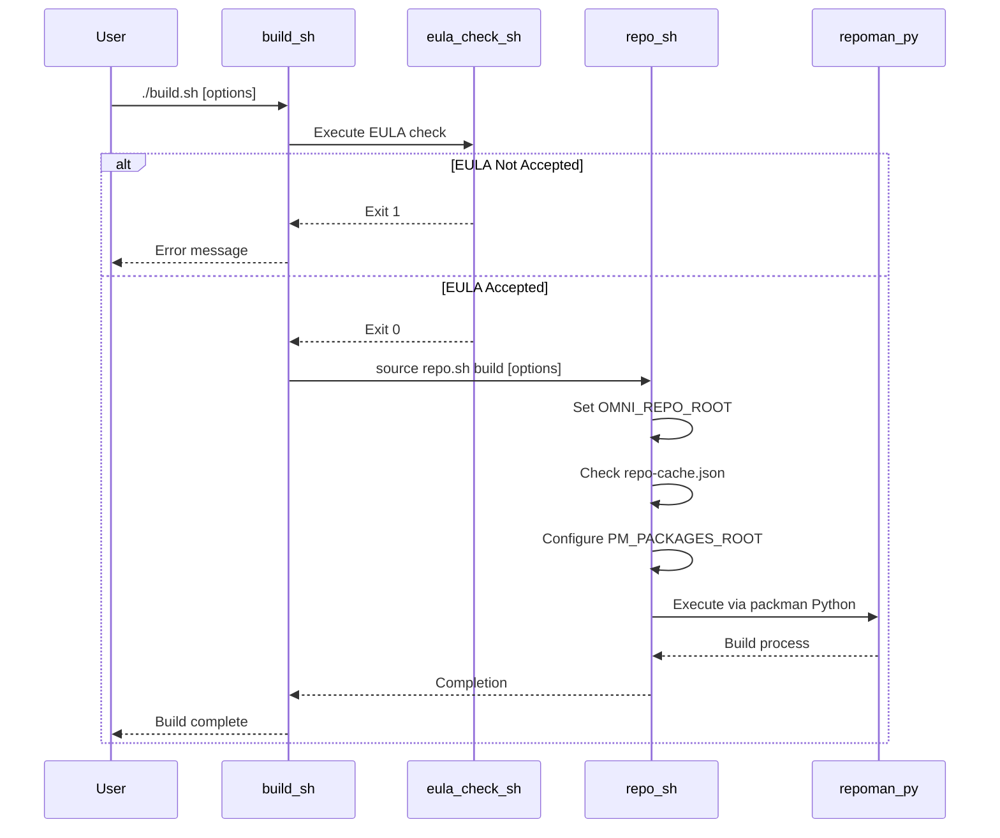

# Build Process

<!-- Auto-generated Table of Contents -->
- [Overview](#overview)
- [Build System Architecture](#build-system-architecture)
- [Build Process Execution](#build-process-execution)
- [Build Configuration Options](#build-configuration-options)
- [Platform-Specific Instructions](#platform-specific-instructions)
- [Build Troubleshooting](#build-troubleshooting)

## Overview

The Isaac Sim build and setup process involves multiple scripts that orchestrate dependency management, compilation, and environment configuration. The process is designed to be cross-platform, with separate scripts for Linux and Windows systems. The build system ensures proper dependency resolution, license compliance, and development environment setup.

## Build System Architecture

The build system follows a structured architecture with clear separation of concerns:



### System Components

1. **User Interface Layer** - `build.sh` (Linux) / `build.bat` (Windows)
2. **License Verification** - `eula_check.sh` / `eula_check.bat`
3. **Environment Configuration** - `repo.sh` / `repo.bat`
4. **Build Orchestration** - `repoman.py` via Packman Python
5. **Dependency Management** - Packman system for external dependencies

## Build Process Execution

### Primary Build Script (Linux)
The main entry point for building Isaac Sim on Linux:

```bash
#!/bin/bash
SCRIPT_DIR=$(dirname ${BASH_SOURCE})

# Check EULA acceptance first
"${SCRIPT_DIR}/tools/eula_check.sh"
EULA_STATUS=$?

if [ $EULA_STATUS -ne 0 ]; then
    echo "Error: NVIDIA Software License Agreement must be accepted to proceed."
    exit 1
fi

set -e
source "$SCRIPT_DIR/repo.sh" build $@ || exit $?
```

### Build Process Steps

1. **EULA Verification** - Checks for license acceptance via [`tools/eula_check.sh`](../../tools/eula_check.sh)
2. **Environment Setup** - Sets error handling with `set -e` for immediate failure detection
3. **Build Orchestration** - Delegates to [`repo.sh`](../../repo.sh) with build command and arguments
4. **Dependency Resolution** - Packman resolves and downloads required dependencies
5. **Compilation** - Native code compilation and Python package installation
6. **Asset Processing** - Resource optimization and packaging

### Architecture Flow
The build system orchestrates multiple components:

1. **User Command** - `./build.sh [options]` initiates the process
2. **EULA Check** - Verifies license agreement acceptance
3. **Environment Configuration** - Sets up build environment variables
4. **Dependency Management** - Downloads and configures external dependencies
5. **Build Execution** - Compiles code and processes resources
6. **Validation** - Verifies build completeness and integrity

## Build Configuration Options

### Command-Line Options
The build system supports various configuration options:

#### Linux Build Options (`build.sh`)
- `-c, --clean` - Clean the repository and exit
- `-x, --rebuild` - Perform a full rebuild by cleaning first
- `--config [debug|release]` - Specify build configuration (default: release)
- `-j NUM_CORES` - Limit parallel compilation jobs
- `--fetch-only` - Only fetch dependencies without building
- `--generate` - Generate projects and stage files without building

#### Windows Build Options (`build.bat`)
Similar options are available for Windows with equivalent functionality.

### Build Configurations

#### Debug Configuration
- **Symbols** - Full debug symbol generation
- **Optimizations** - Minimal optimization for debugging
- **Assertions** - Enhanced error checking and validation
- **Logging** - Verbose logging for development

#### Release Configuration  
- **Optimization** - Maximum performance optimization
- **Symbol Stripping** - Reduced binary size
- **Error Handling** - Production-level error management
- **Asset Optimization** - Compressed resources and textures

### Environment Variables
Key environment variables affecting the build:

```bash
# Repository root directory
export OMNI_REPO_ROOT=/path/to/isaac-sim

# Package cache directory for faster builds
export PM_PACKAGES_ROOT=/path/to/package/cache

# Build configuration
export BUILD_CONFIG=release

# Parallel job control
export MAKEFLAGS=-j$(nproc)
```

## Platform-Specific Instructions

### Linux (Ubuntu 22.04)

#### Prerequisites
```bash
# Install build dependencies
sudo apt-get update
sudo apt-get install build-essential git git-lfs

# Install Python 3.11
sudo apt-get install python3.11 python3.11-dev

# Set up GCC/G++ 11 (required for Isaac Sim)
sudo apt-get install gcc-11 g++-11
sudo update-alternatives --install /usr/bin/gcc gcc /usr/bin/gcc-11 200
sudo update-alternatives --install /usr/bin/g++ g++ /usr/bin/g++-11 200
```

#### Build Execution
```bash
# Clone repository (if not already done)
git clone <repository-url>
cd isaacsim

# Initialize Git LFS
git lfs install
git lfs pull

# Execute build
./build.sh

# Run Isaac Sim after build
cd _build/linux-x86_64/release
./isaac-sim.sh
```

### Windows 10/11

#### Prerequisites
- **Visual Studio 2019 or later** with C++ development workload
- **Git for Windows** with Git LFS support
- **Python 3.11** (official Python.org distribution recommended)

#### Build Execution
```powershell
# Clone repository
git clone <repository-url>
cd isaacsim

# Initialize Git LFS  
git lfs install
git lfs pull

# Execute build
build.bat

# Run Isaac Sim after build
cd _build\windows-x86_64\release
isaac-sim.bat
```

### Docker Containerization
For containerized deployments, the setup script configures Docker integration:

```bash
# Run setup script for Docker configuration
./setup.sh

# Verify Docker and NVIDIA Container Toolkit
docker run --rm --gpus all nvidia/cuda:12.0-base nvidia-smi
```

## Build Troubleshooting

### Common Build Issues

#### EULA Acceptance Problems
**Symptom:** Build fails with EULA error message
**Solution:**
```bash
# Manually trigger EULA acceptance
./tools/eula_check.sh

# Verify acceptance file exists
ls -la .eula_accepted
```

#### Compiler Version Issues
**Symptom:** Build fails with GCC/G++ version errors on Linux
**Solution:**
```bash
# Install and configure GCC/G++ 11
sudo apt-get install gcc-11 g++-11
sudo update-alternatives --install /usr/bin/gcc gcc /usr/bin/gcc-11 200
sudo update-alternatives --install /usr/bin/g++ g++ /usr/bin/g++-11 200

# Verify correct versions
gcc --version
g++ --version
```

#### Dependency Resolution Failures
**Symptom:** Packman fails to download dependencies
**Solutions:**
```bash
# Clear package cache
rm -rf _build/target-deps/
rm -rf ~/.packman/

# Retry build with clean state
./build.sh --clean
./build.sh
```

#### Git LFS Issues
**Symptom:** Large file download failures
**Solutions:**
```bash
# Reinstall Git LFS
git lfs uninstall
git lfs install

# Force pull all LFS files
git lfs pull --all

# Verify LFS files
git lfs ls-files
```

#### Windows Path Length Limitations
**Symptom:** Build fails with path length errors on Windows
**Solutions:**
- Enable long path support in Windows 10/11
- Use shorter directory names
- Build closer to drive root (e.g., `C:\isaac-sim`)

### Build Verification

#### Post-Build Validation
```bash
# Verify build output directory exists
ls -la _build/linux-x86_64/release/

# Check for essential executables
ls -la _build/linux-x86_64/release/isaac-sim.sh

# Verify Python dependencies
ls -la _build/target-deps/isaac_core_prebundle/

# Test basic functionality
cd _build/linux-x86_64/release
./isaac-sim.sh --help
```

#### Performance Validation
```bash
# Check GPU accessibility
nvidia-smi

# Verify CUDA installation
nvcc --version

# Test basic simulation
cd _build/linux-x86_64/release
./isaac-sim.sh --headless --test
```

### Build Optimization

#### Parallel Compilation
```bash
# Use all available CPU cores
./build.sh -j$(nproc)

# Limit cores for system stability
./build.sh -j4
```

#### Incremental Builds
```bash
# Fast incremental build (after initial build)
./build.sh

# Force complete rebuild when needed
./build.sh --rebuild
```

#### Package Caching
```bash
# Set persistent package cache directory
export PM_PACKAGES_ROOT=$HOME/.packman-cache
./build.sh
```

---

**Referenced Files:**
- [build.sh](../../build.sh) - Linux build script
- [build.bat](../../build.bat) - Windows build script  
- [repo.sh](../../repo.sh) - Repository configuration script
- [tools/eula_check.sh](../../tools/eula_check.sh) - EULA verification script

**Related Topics:**
- [Dependency Management](dependency-management.md)
- [Environment Configuration](environment-configuration.md)
- [EULA and Licensing](eula-and-licensing.md)