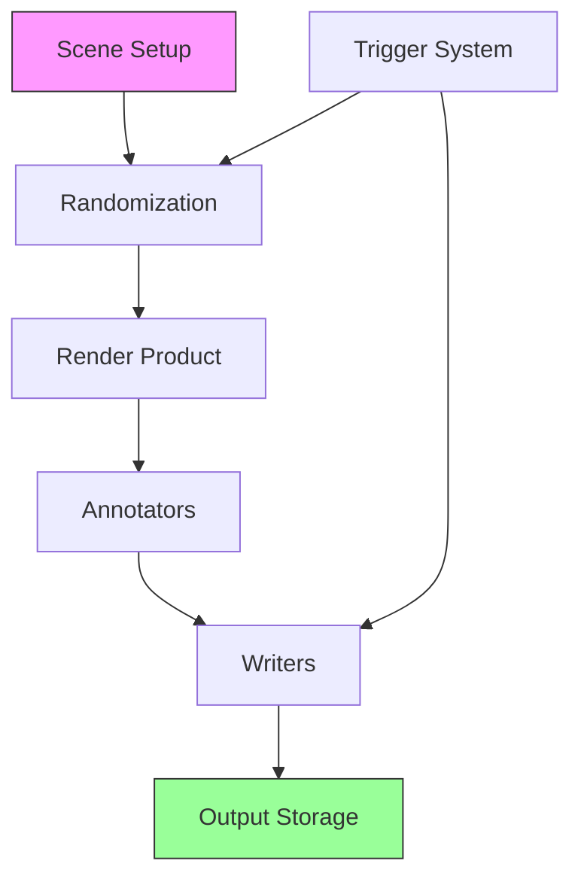
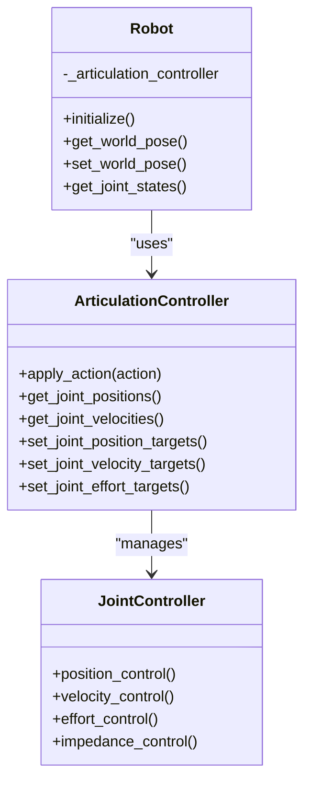

# Core Features

<!-- Auto-generated Table of Contents -->
- [Overview](#overview)
- [Synthetic Data Generation](#synthetic-data-generation)
- [ROS 2 Integration](#ros-2-integration)
- [Robotics Framework](#robotics-framework)
- [Physics and Rendering](#physics-and-rendering)
- [Development and Integration Tools](#development-and-integration-tools)

## Overview

Isaac Sim provides a comprehensive set of core features designed to enable high-fidelity robotics simulation, AI training, and development workflows. The platform's modular architecture supports various specialized capabilities while maintaining seamless integration between components.

## Synthetic Data Generation

### Replicator Framework
Isaac Sim's synthetic data generation system is built around the Replicator framework, which enables the creation of large-scale, photorealistic datasets for training machine learning models. The Replicator system employs a node-based pipeline design that enables flexible and scalable synthetic data generation.



The architecture consists of several key components:
- **Render Products** - Represent camera sensors that capture images from specific viewpoints
- **Annotators** - Generate ground truth data such as semantic segmentation, bounding boxes, and depth maps
- **Writers** - Handle the recording and formatting of generated data
- **Orchestrator** - Manages the execution flow and synchronization of the pipeline

### Domain Randomization Techniques
Domain randomization is a crucial technique for creating diverse and robust synthetic datasets. The core of this system is domain randomization, a technique that introduces controlled variations in simulation parameters to improve model generalization.

#### Material Randomization
Material properties can be randomized to simulate different surface appearances and physical characteristics:

```python
def randomize_colors(prim_path_regex):
    prims = rep.get.prims(path_pattern=prim_path_regex)
    mats = rep.create.material_omnipbr(
        metallic=rep.distribution.uniform(0.0, 1.0),
        roughness=rep.distribution.uniform(0.0, 1.0),
        diffuse=rep.distribution.uniform((0, 0, 0), (1, 1, 1)),
        count=100,
    )
    with prims:
        rep.randomizer.materials(mats)
    return prims.node
```

#### Physics Randomization
The domain randomization implementation exposes a comprehensive set of attributes for different simulation entities:

**Simulation Context Attributes:**
- `gravity` - Randomization of gravitational acceleration vector

**Rigid Prim Attributes:**
- `angular_velocity`, `linear_velocity`, `velocity` - Kinematic state randomization
- `mass`, `density` - Physical property variation
- `material_properties` - Surface characteristic modification

**Articulation Attributes:**
- `stiffness`, `damping`, `joint_friction` - Joint dynamics randomization
- `joint_positions`, `joint_velocities` - Articulated state variation
- `lower_dof_limits`, `upper_dof_limits` - Joint range modification
- `max_efforts`, `joint_armatures` - Actuation capability variation
- `body_masses`, `body_inertias` - Link physical properties
- `tendon_stiffnesses`, `tendon_dampings` - Tendon-driven mechanism parameters

#### Data Recording Workflows
The data recording workflow follows a three-phase process:

1. **Registration Phase** - Simulation entities are registered with the randomization system
2. **Randomization Phase** - The `step_randomization()` function triggers parameter updates
3. **Recording Phase** - Data capture and annotation generation

```python
# Example of configuring domain randomization
_simulation_context_initial_values["gravity"] = gravity_vector
_simulation_context_reset_values["gravity"] = copy.deepcopy(gravity_vector)
```

### Annotator System
The annotator system provides comprehensive ground truth data generation:

- **RGB Images** - High-fidelity color image capture
- **Depth Maps** - Precise distance measurements
- **Semantic Segmentation** - Object class labeling
- **Instance Segmentation** - Individual object identification
- **Bounding Boxes** - 2D and 3D object localization
- **Surface Normals** - Geometric surface information
- **Motion Vectors** - Object movement tracking

### Synthetic Recorder
The Synthetic Recorder system manages the entire data recording process:

#### Trigger Mechanisms
- **Frame-based** - Recording occurs on every frame or at specified intervals
- **Event-based** - Recording triggered by specific events or conditions
- **Manual** - Recording started and stopped through UI controls

```python
async def start_stop_async(self):
    timeline = omni.timeline.get_timeline_interface()
    if self._state == RecorderState.STOPPED and self.init_recorder():
        if self.verbose:
            print(f"[SDR][Recorder] Start;\tFrame: {self._current_frame};\tTime: {timeline.get_current_time():.4f}.")
        await rep.orchestrator.preview_async()
        self._set_state(RecorderState.RUNNING)
        if self.control_timeline and not timeline.is_playing():
            timeline.play()
            timeline.commit()
        num_frames = self.num_frames if self.num_frames > 0 else MAX_NUM_FRAMES
        await self._run_recording_loop_async(num_frames)
```

## ROS 2 Integration

### Bridge Architecture
Isaac Sim provides comprehensive ROS 2 integration through the `isaacsim.ros2.bridge` extension, enabling bidirectional communication between the simulation environment and external ROS 2 systems. This integration follows a modular architecture that supports various message types, services, and quality of service (QoS) configurations.

The ROS 2 bridge architecture is implemented as a factory pattern that creates and manages various ROS 2 entities:

```mermaid
classDiagram
    class ROS2Bridge {
        +create_publisher()
        +create_subscriber() 
        +create_service_client()
        +create_service_server()
        +manage_lifecycle()
    }
    
    class MessageFactory {
        +create_message()
        +convert_types()
        +validate_schema()
    }
    
    class QoSManager {
        +configure_reliability()
        +set_durability()
        +manage_history()
        +handle_liveliness()
    }
    
    ROS2Bridge --> MessageFactory : "uses"
    ROS2Bridge --> QoSManager : "configures"
    MessageFactory --> "ROS 2 Messages" : "creates"
    QoSManager --> "ROS 2 QoS Policies" : "manages"
```

### Topic Communication
The ROS 2 integration supports comprehensive topic-based communication:

- **Publisher Nodes** - Send sensor data, robot state, and simulation information
- **Subscriber Nodes** - Receive control commands and configuration updates
- **Message Conversion** - Automatic translation between Isaac Sim and ROS 2 data types
- **QoS Configuration** - Flexible quality of service settings for different use cases

### Service Integration
ROS 2 service integration enables:

- **Synchronous Communication** - Request/response patterns for critical operations
- **Robot Control Services** - High-level robot command interfaces
- **Configuration Services** - Runtime parameter adjustment
- **Diagnostic Services** - System health monitoring and reporting

### Message Conversion System
Automatic message conversion between Isaac Sim internal formats and ROS 2 standard messages:

- **Geometry Messages** - Position, orientation, and transformation data
- **Sensor Messages** - Camera images, point clouds, IMU data
- **Robot Messages** - Joint states, trajectories, and control commands
- **Navigation Messages** - Maps, paths, and odometry information

## Robotics Framework

### Robot Representation
Isaac Sim supports multiple robot description formats:

- **URDF Import/Export** - Universal Robot Description Format support
- **MJCF Integration** - MuJoCo model format compatibility  
- **USD Robot Models** - Native Omniverse scene description
- **CAD Integration** - Direct CAD file import and conversion

### Articulation Control
Comprehensive articulation control system:



### Robot Sensors
Comprehensive sensor simulation capabilities:

#### Camera Sensors
- **RGB Cameras** - High-fidelity color image capture
- **Depth Cameras** - Precise distance measurement
- **Stereo Cameras** - Binocular vision systems
- **Fisheye Cameras** - Wide-angle distorted imaging

#### Physics-Based Sensors
- **IMU Sensors** - Inertial measurement units with realistic noise
- **Force/Torque Sensors** - Contact force measurement
- **Proximity Sensors** - Distance-based detection
- **Contact Sensors** - Collision detection and response

#### RTX-Powered Sensors
- **RTX LiDAR** - GPU-accelerated point cloud generation
- **RTX Radar** - Realistic radar simulation
- **Advanced Cameras** - Ray-traced realistic imaging with lens effects

### Motion Generation
Sophisticated motion planning and execution:

- **Path Planning** - Collision-free trajectory generation
- **Inverse Kinematics** - Target pose achievement
- **Motion Primitives** - Pre-defined movement patterns
- **Behavioral Control** - High-level task execution

## Physics and Rendering

### Physics Engine (PhysX)
NVIDIA PhysX integration provides:

- **Rigid Body Dynamics** - Accurate object physics simulation
- **Multi-body Articulation** - Complex robotic system modeling
- **Collision Detection** - Efficient contact resolution
- **Soft Body Simulation** - Deformable object modeling
- **Fluid Simulation** - Liquid and gas dynamics
- **Particle Systems** - Granular material modeling

### Rendering Engine (RTX)
RTX real-time ray tracing delivers:

- **Photorealistic Rendering** - Movie-quality visual fidelity
- **Real-time Ray Tracing** - GPU-accelerated global illumination
- **Advanced Materials** - Physically-based rendering (PBR)
- **Dynamic Lighting** - Realistic light transport simulation
- **Post-processing Effects** - Advanced visual enhancement

### GPU Acceleration
Comprehensive GPU utilization:

- **CUDA Integration** - Direct GPU compute access
- **Multi-GPU Support** - Parallel simulation scaling
- **Memory Management** - Efficient GPU resource utilization
- **Streaming** - Dynamic asset loading and unloading

## Development and Integration Tools

### Python API
Comprehensive Python interface:

```python
# Core simulation control
from isaacsim.core import SimulationApp, World
from isaacsim.core.utils import SimulationContext
from isaacsim.core.robots import Robot

# Synthetic data generation
import omni.replicator.core as rep

# ROS 2 integration  
from isaacsim.ros2_bridge import ROS2Bridge
```

### Jupyter Notebook Integration
Interactive development environment:

- **Live Simulation Control** - Real-time parameter adjustment
- **Data Visualization** - Integrated plotting and analysis
- **Collaborative Development** - Shared notebook environments
- **Educational Content** - Tutorial and example notebooks

### VS Code Integration
Professional development environment:

- **Debugging Support** - Breakpoints and step-through debugging
- **IntelliSense** - Code completion and documentation
- **Extension Ecosystem** - Additional productivity tools
- **Version Control** - Git integration and collaboration

### Command-Line Tools
Automation and scripting support:

- **Batch Processing** - Headless simulation execution
- **Asset Processing** - Bulk asset conversion and optimization
- **Build Tools** - Project compilation and packaging
- **Testing Frameworks** - Automated validation and verification

---

**Related Topics:**
- [Platform Overview](platform-overview.md)
- [System Architecture](system-architecture.md)
- [Synthetic Data Generation](synthetic-data-generation.md)
- [ROS 2 Integration](ros2-integration.md)
- [Robotics Framework](robotics-framework.md)