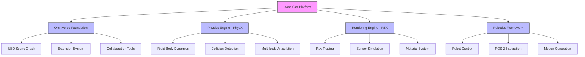

# Platform Overview

<!-- Auto-generated Table of Contents -->
- [Introduction](#introduction)
- [Key Capabilities](#key-capabilities)
- [Core Technologies](#core-technologies)
- [Use Cases and Applications](#use-cases-and-applications)
- [Architecture Components](#architecture-components)
- [Integration Ecosystem](#integration-ecosystem)

## Introduction

NVIDIA Isaac Sim is a high-fidelity robotics simulation platform built on NVIDIA Omniverse, designed to develop, test, train, and deploy AI-powered robots in realistic virtual environments. It provides high-fidelity simulation capabilities for robotics development, enabling synthetic data generation, reinforcement learning, and ROS integration.

Isaac Sim serves as a comprehensive environment for robotics development, AI training, and digital twin applications. The platform leverages GPU-accelerated physics and RTX rendering to provide realistic virtual environments where robotic systems can be developed, tested, trained, and deployed. Isaac Sim is designed as a component-based modular system with an extension architecture that allows developers to customize and extend its functionality.

The platform supports importing robotic systems from common formats such as URDF, MJCF, and CAD, and provides end-to-end workflows for synthetic data generation, reinforcement learning, and ROS 2 integration.

## Key Capabilities

### Simulation and Physics
- **High-fidelity physics simulation** using NVIDIA PhysX
- **GPU-accelerated physics** for enhanced performance
- **Real-time simulation** with accurate dynamics
- **Multi-body articulation support** for complex robotic systems

### Synthetic Data Generation
- **Photorealistic rendering** using RTX technology
- **Domain randomization** for robust model training
- **Automated annotation** for computer vision tasks
- **Scalable data generation** pipelines

### Robotics Integration
- **ROS 2 native support** for seamless integration
- **URDF and MJCF import/export** capabilities
- **Robot control interfaces** for manipulation and navigation
- **Multi-robot coordination** support

### AI and Machine Learning
- **Reinforcement learning** workflows with Isaac Lab
- **Synthetic data training** pipelines
- **Perception model training** with ground truth data
- **Sim-to-real transfer** capabilities

## Core Technologies

### NVIDIA Omniverse Platform
Isaac Sim is built on the NVIDIA Omniverse platform, leveraging:
- **Universal Scene Description (USD)** for scene representation
- **Real-time collaborative workflows**
- **Cross-platform compatibility**
- **Extensible architecture**

### Rendering and Graphics
- **RTX real-time ray tracing** for photorealistic visuals
- **GPU-accelerated rendering** pipeline
- **Multi-camera sensor simulation**
- **Advanced lighting and materials**

### Physics Simulation
- **NVIDIA PhysX** integration
- **Rigid body dynamics**
- **Soft body simulation**
- **Collision detection and response**

### AI and Robotics
- **Isaac Lab** for reinforcement learning
- **Replicator** for synthetic data generation
- **ROS 2 bridge** for robotics integration
- **Custom extension support**

## Use Cases and Applications

### Robotics Development
- **Autonomous mobile robots** (AMR) development and testing
- **Manipulator control** system development
- **Multi-robot coordination** scenarios
- **Human-robot interaction** studies

### AI Training and Validation
- **Computer vision model training** with synthetic data
- **Reinforcement learning** for robotic policies
- **Perception system validation** in diverse scenarios
- **Sim-to-real transfer** validation

### Digital Twin Applications
- **Virtual replicas** of physical systems
- **Testing and optimization** before deployment
- **System monitoring** and analysis
- **Predictive maintenance** scenarios

### Education and Research
- **Robotics education** with interactive simulations
- **Research prototyping** in safe virtual environments
- **Algorithm development** and validation
- **Collaborative research** projects

## Architecture Components

Isaac Sim's architecture is built around several core components that work together to provide a comprehensive simulation environment:

### Core Simulation Components
- **SimulationContext** - Central coordinator for simulation timing and callbacks
- **World** - High-level environment manager and task coordinator  
- **Scene** - Container for simulation objects and spatial organization
- **PhysicsContext** - Physics-specific settings and parameter management

### Extension System
- **Modular architecture** supporting custom extensions
- **Plugin ecosystem** for specialized functionality
- **API interfaces** for third-party integration
- **Event-driven architecture** for component communication

## Integration Ecosystem

### ROS 2 Integration
Isaac Sim provides comprehensive ROS 2 integration enabling:
- **Bidirectional communication** with ROS 2 systems
- **Message type support** for standard robotics interfaces
- **Service integration** for robot control
- **Quality of Service (QoS)** configuration

### Development Tools
- **Python API** for programmatic control
- **Jupyter Notebook** integration for interactive development
- **VS Code** integration with debugging support
- **Command-line tools** for automation

### Cloud and Compute
- **Cloud deployment** support for scalable simulations
- **Container integration** with Docker and Kubernetes
- **Multi-GPU scaling** for performance optimization
- **Headless operation** for automated workflows

### Third-Party Integrations
- **Isaac Lab** for reinforcement learning workflows
- **Replicator** for synthetic data generation
- **Navigation frameworks** for path planning
- **Perception libraries** for computer vision

## Getting Started

To begin using Isaac Sim:

1. **Installation** - Follow the [Build Process](../installation-and-setup/build-process.md) guide
2. **Basic Concepts** - Learn about [Core Architecture](../core-architecture/simulation-context.md)
3. **First Simulation** - Try the [Standalone Examples](../examples-and-tutorials/standalone-examples/README.md)
4. **Advanced Features** - Explore [Synthetic Data Generation](../data-generation-and-synthetic-data/domain-randomization.md)

For comprehensive learning paths, see our [Interactive Tutorials](../examples-and-tutorials/interactive-tutorials.md) section.

---

**Related Topics:**
- [System Architecture](system-architecture.md)
- [Core Features](core-features.md)
- [Installation Guide](../installation-and-setup/build-process.md)