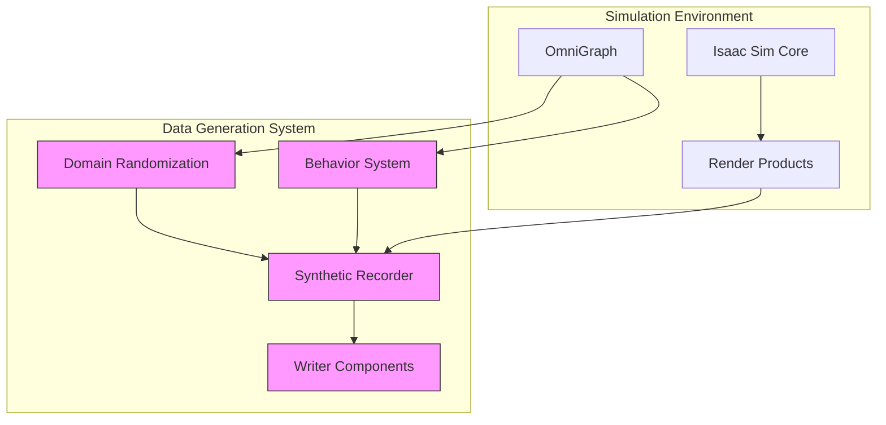
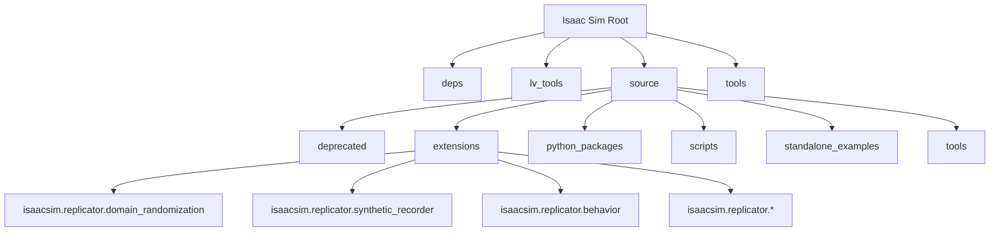
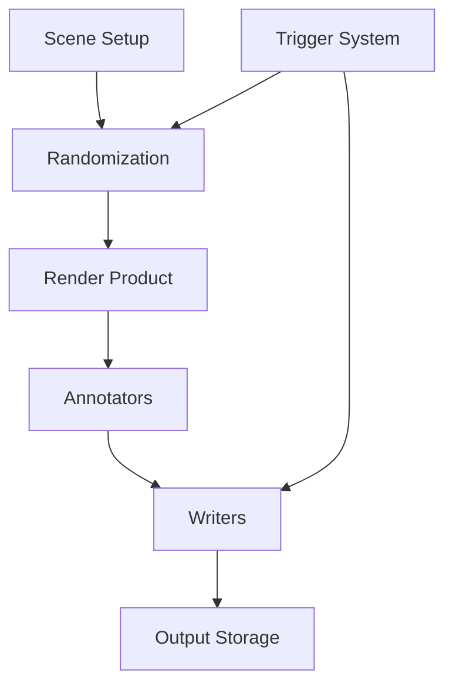

# Synthetic Data Generation

<!-- Auto-generated Table of Contents -->
- [Introduction](#introduction)
- [System Architecture](#system-architecture)  
- [Core Components](#core-components)
- [Workflow Examples](#workflow-examples)
- [Integration with ML Pipelines](#integration-with-ml-pipelines)

## Introduction

Synthetic data generation plays a critical role in training artificial intelligence models, particularly in computer vision applications where real-world data collection can be expensive, time-consuming, or unsafe. NVIDIA Isaac Sim provides a powerful framework for generating high-fidelity synthetic datasets through its Replicator system.

This system enables the creation of diverse, annotated datasets for object detection, segmentation, depth estimation, and other computer vision tasks through domain randomization, behavior systems, and the synthetic recorder.

## System Architecture

The synthetic data generation architecture in Isaac Sim follows a modular, extensible design that separates concerns between environment creation, data capture, and output formatting. The system leverages the Replicator framework to generate synthetic data through domain randomization and behavioral scripting.



### Project Structure

The Isaac Sim repository organizes synthetic data generation components in a modular architecture with clear separation between core simulation functionality and specialized data generation tools.



## Core Components

### Replicator System Architecture

The Replicator system employs a node-based pipeline design that enables flexible and scalable synthetic data generation. At its core, the system uses a graph-based approach where nodes represent different operations in the data generation process, including scene creation, randomization, annotation, and recording.

The architecture consists of several key components:
- **Render Products** - Represent camera sensors that capture images from specific viewpoints
- **Annotators** - Generate ground truth data such as semantic segmentation, bounding boxes, and depth maps
- **Writers** - Handle the recording and formatting of generated data
- **Orchestrator** - Manages the execution flow and synchronization of the pipeline



### Data Generation Workflows

Isaac Sim supports multiple data generation workflows for different computer vision tasks:

#### Object Detection Workflow
1. Create scene with target objects
2. Apply domain randomization to appearance and layout
3. Configure camera render products
4. Set up bounding box annotations
5. Record sequences with varying object configurations
6. Export data in COCO or Pascal VOC format

#### Segmentation Workflow  
1. Build scene with multiple object classes
2. Apply material and texture randomization
3. Configure semantic segmentation render products
4. Set up instance segmentation annotations
5. Generate pixel-perfect ground truth masks
6. Export segmentation data with class mappings

#### Depth Estimation Workflow
1. Design scene with appropriate depth variation
2. Configure depth render product
3. Apply lighting and appearance randomization
4. Capture synchronized RGB and depth images
5. Export with calibration parameters
6. Include ground truth depth maps

These workflows leverage the Synthetic Recorder to manage the capture process and ensure consistent data output.

### Domain Randomization Techniques

#### Object Placement Perturbation
The system provides sophisticated object placement randomization:

```python
async def start_stop_async(self):
    timeline = omni.timeline.get_timeline_interface()
    if self._state == RecorderState.STOPPED and self.init_recorder():
        if self.verbose:
            print(f"[SDR][Recorder] Start;\tFrame: {self._current_frame};\tTime: {timeline.get_current_time():.4f}.")
        await rep.orchestrator.preview_async()
        self._set_state(RecorderState.RUNNING)
        if self.control_timeline and not timeline.is_playing():
            timeline.play()
            timeline.commit()
        num_frames = self.num_frames if self.num_frames > 0 else MAX_NUM_FRAMES
        await self._run_recording_loop_async(num_frames)
```

#### Geometry Randomization
Geometry variations include:
- Object dimensions and proportions
- Shape parameters and mesh deformations  
- Component configurations and articulations
- Collision geometry modifications

#### Layout Randomization
Layout variations encompass:
- Object placement and arrangement
- Scene composition and spatial relationships
- Environmental elements (furniture, obstacles)
- Dynamic element positioning

These randomization techniques work together to create a vast array of possible scenarios from a limited set of base assets, significantly increasing dataset diversity without requiring additional 3D modeling.

## Workflow Examples

### Complete Data Generation Pipeline Example

```python
import omni.replicator.core as rep
from isaacsim.core import SimulationApp

# Initialize simulation
simulation_app = SimulationApp({"headless": True})

# Set up environment
rep.create.light(light_type="Dome", intensity=1000)
ground = rep.create.plane(scale=(100, 100, 1))

# Create target objects with randomization
objects = rep.create.cube(count=10, scale=rep.distribution.uniform(0.5, 2.0))
with objects:
    rep.randomizer.materials(
        rep.create.material_omnipbr(
            metallic=rep.distribution.uniform(0.0, 1.0),
            roughness=rep.distribution.uniform(0.0, 1.0),
            diffuse=rep.distribution.uniform((0.1, 0.1, 0.1), (1.0, 1.0, 1.0))
        )
    )

# Setup camera and render product
camera = rep.create.camera()
render_product = rep.create.render_product(camera, (512, 512))

# Configure randomization triggers
with rep.trigger.on_frame():
    with objects:
        rep.modify.pose(
            position=rep.distribution.uniform((-10, -10, 0), (10, 10, 5)),
            rotation=rep.distribution.uniform((0, 0, 0), (360, 360, 360))
        )
    
    with camera:
        rep.modify.pose(
            position=rep.distribution.uniform((-15, -15, 5), (15, 15, 15)),
            look_at=objects
        )

# Setup data writer
writer = rep.WriterRegistry.get("BasicWriter")
writer.initialize(
    output_dir="./synthetic_data",
    rgb=True,
    bounding_box_2d_tight=True,
    semantic_segmentation=True,
    instance_segmentation=True
)
writer.attach([render_product])

# Generate data
rep.orchestrator.run_until_complete()
for i in range(1000):
    rep.orchestrator.step()

# Cleanup
writer.detach()
render_product.destroy()
simulation_app.close()
```

### Object-Based Synthetic Data Generation

For more focused object-based data generation:

```python
# Setup scene with specific target objects
target_objects = []
for i in range(5):
    obj = rep.create.from_usd(f"/path/to/asset_{i}.usd")
    target_objects.append(obj)

# Apply object-specific randomization
for obj in target_objects:
    with obj:
        rep.modify.semantics([("class", f"target_class_{i}")])
        rep.randomizer.materials(create_random_material())
        rep.modify.pose(
            position=rep.distribution.uniform(bounds_min, bounds_max),
            rotation=rep.distribution.uniform((0, 0, 0), (360, 360, 360))
        )

# Multiple camera viewpoints
cameras = []
for angle in [0, 45, 90, 135, 180, 225, 270, 315]:
    cam = rep.create.camera(rotation=(0, angle, 0))
    cameras.append(cam)

# Create render products for each camera
render_products = []
for i, cam in enumerate(cameras):
    rp = rep.create.render_product(cam, (640, 640), name=f"camera_{i}")
    render_products.append(rp)

# Configure writer for multi-camera setup
writer.attach(render_products)
```

## Integration with ML Training Pipelines

The synthetic data generation system is designed to integrate seamlessly with machine learning training pipelines. The Synthetic Recorder outputs data in formats compatible with popular ML frameworks, and the domain randomization ensures that models trained on synthetic data can generalize to real-world conditions.

### Key Integration Points
- **Configurable writers** that support various data formats
- **Automatic annotation generation** with ground truth labels
- **Metadata export** with scene information
- **Support for distributed data generation** across multiple machines
- **Integration with data preprocessing pipelines**

The system's modular design allows for easy extension to support new data formats and training requirements.

### Output Data Formats
The generated synthetic datasets include:

- **RGB Images** - High-fidelity rendered images
- **Depth Maps** - Accurate distance information
- **Semantic Segmentation** - Pixel-level class labels
- **Instance Segmentation** - Individual object identification
- **Bounding Boxes** - 2D and 3D object localization
- **Camera Calibration** - Intrinsic and extrinsic parameters
- **Metadata** - Scene composition and randomization parameters

---

**Referenced Files:**
- [synthetic_recorder.py](../../source/extensions/isaacsim.replicator.synthetic_recorder/isaacsim/replicator/synthetic_recorder/synthetic_recorder.py)
- [pose_generation.py](../../source/standalone_examples/replicator/pose_generation/pose_generation.py)
- [Domain Randomization Extension](../../source/extensions/isaacsim.replicator.domain_randomization/config/extension.toml)

**Related Topics:**
- [Domain Randomization](domain-randomization.md)
- [Synthetic Data Recording](synthetic-data-recording.md)
- [Behavior System](behavior-system.md)