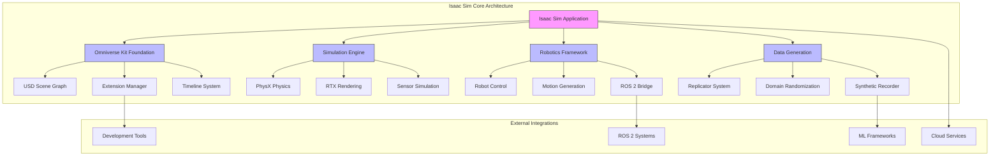
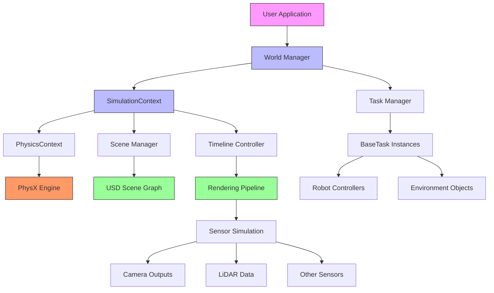
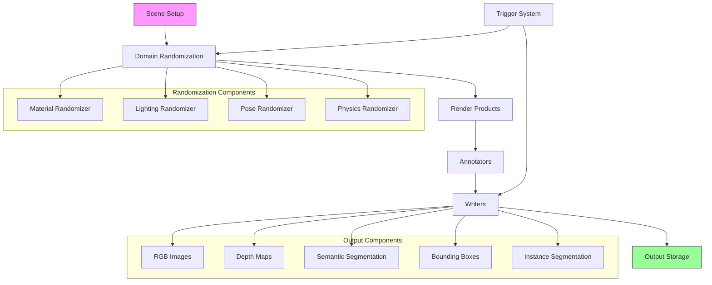

# System Architecture

<!-- Auto-generated Table of Contents -->
- [Architecture Overview](#architecture-overview)
- [Core Components](#core-components)
- [System Integration](#system-integration)
- [Extension Architecture](#extension-architecture)
- [Data Flow and Processing](#data-flow-and-processing)
- [Platform Integration](#platform-integration)

## Architecture Overview

Isaac Sim is built on the NVIDIA Omniverse platform, leveraging USD (Universal Scene Description) for scene representation and simulation. It integrates with physics engines, rendering pipelines, and robotics frameworks to provide a comprehensive simulation environment.

The overall architecture follows a modular, extensible design that separates concerns between environment creation, simulation execution, data capture, and output formatting. The system is designed around several key architectural patterns:

- **Modular Extension Architecture** - Isaac Sim supports modular extensions for adding new features (e.g., sensors, robots, workflows)
- **Event-Driven Architecture** - For handling simulation events and interactions
- **Component-Based Design** - For flexible robot and environment modeling
- **Pipeline-based Data Flow** - For synthetic data generation and reinforcement learning workflows



## Core Components

### Simulation Application Layer
The top-level simulation application manages the overall simulation environment and provides access to various subsystems:

- **Application Interface** - Main entry point for simulation control
- **Framework Management** - Coordination between different subsystems
- **Timeline Control** - Simulation time management and playback
- **Event System** - Inter-component communication

### Omniverse Kit Foundation
Built on NVIDIA Omniverse Kit, providing:

- **USD Integration** - Universal Scene Description for scene representation
- **Extension System** - Modular architecture for functionality expansion
- **Collaborative Features** - Multi-user simulation environments
- **Cross-Platform Support** - Windows and Linux compatibility

### Physics and Rendering Engine
Core simulation capabilities:

```mermaid
classDiagram
    class SimulationContext {
        +initialize()
        +step()
        +reset()
        +add_callbacks()
        -_physics_context: PhysicsContext
        -_timeline_interface: Timeline
    }
    
    class PhysicsContext {
        +set_gravity()
        +set_solver_type()
        +set_broadphase_type()
        +get_physics_dt()
        -_physx_interface: PhysXInterface
    }
    
    class RenderingEngine {
        +create_render_product()
        +setup_cameras()
        +configure_lighting()
        +rtx_settings()
    }
    
    SimulationContext --> PhysicsContext : "manages"
    SimulationContext --> RenderingEngine : "coordinates"
    PhysicsContext --> "PhysX Engine" : "interfaces"
    RenderingEngine --> "RTX Pipeline" : "uses"
```

### Robotics Framework
Specialized robotics capabilities:

- **Robot Representation** - URDF, MJCF, and USD robot loading
- **Articulation Control** - Joint and actuator management
- **Motion Generation** - Path planning and trajectory execution
- **Sensor Integration** - Camera, LiDAR, IMU, and custom sensors

## System Integration

### Component Interaction Flow
The system follows a hierarchical interaction pattern:



### Data Flow Architecture
Isaac Sim implements a sophisticated data flow system:

1. **Input Processing** - User commands and external data
2. **Simulation Step** - Physics and rendering updates
3. **Data Collection** - Sensor outputs and state information
4. **Processing Pipeline** - Domain randomization and augmentation
5. **Output Generation** - Annotations, images, and telemetry

## Extension Architecture

### Extension System Design
Isaac Sim's extensible architecture allows for modular functionality:

```mermaid
graph TB
    subgraph "Extension Architecture"
        A[Core Extensions] --> B[isaac.core]
        A --> C[isaac.kit]
        A --> D[isaac.sensor]
        
        E[Robotics Extensions] --> F[isaac.manipulators]
        E --> G[isaac.wheeled_robots]
        E --> H[isaac.quadruped]
        
        I[Integration Extensions] --> J[isaac.ros2_bridge]
        I --> K[isaac.jupyter_notebook]
        I --> L[isaac.vscode]
        
        M[Data Generation] --> N[replicator.isaac]
        M --> O[isaac.synthetic_recorder]
        M --> P[isaac.replicator.domain_randomization]
    end
    
    subgraph "Extension Manager"
        Q[Extension Registry]
        R[Dependency Resolution]
        S[Lifecycle Management]
    end
    
    A --> Q
    E --> Q
    I --> Q
    M --> Q
    
    style A fill:#bbf,stroke:#333
    style E fill:#bbf,stroke:#333
    style I fill:#bbf,stroke:#333
    style M fill:#bbf,stroke:#333
```



### Key Extension Types

#### Core Extensions
- **[isaac.core](../../source/deprecated/omni.isaac.core/README.md)** - Fundamental simulation components
- **[isaac.kit](../../source/deprecated/omni.isaac.kit/README.md)** - Application framework integration
- **[isaac.sensor](../../source/deprecated/omni.isaac.sensor/README.md)** - Sensor simulation framework

#### Robotics Extensions
- **[isaac.manipulators](../../source/deprecated/omni.isaac.manipulators/README.md)** - Robotic arm control and manipulation
- **[isaac.wheeled_robots](../../source/deprecated/omni.isaac.wheeled_robots/README.md)** - Mobile robot platforms
- **[isaac.surface_gripper](../../source/deprecated/omni.isaac.surface_gripper/README.md)** - Gripper and grasping systems

#### Integration Extensions
- **[isaac.ros2_bridge](../../source/deprecated/omni.isaac.ros2_bridge/README.md)** - ROS 2 communication bridge
- **[isaac.jupyter_notebook](../../source/deprecated/omni.isaac.jupyter_notebook/README.md)** - Interactive development environment
- **[isaac.vscode](../../source/deprecated/omni.isaac.vscode/README.md)** - VS Code integration and debugging

## Data Flow and Processing

### Synthetic Data Generation Pipeline
The data generation system follows a sophisticated pipeline architecture:



### Processing Pipeline Components
- **Render Products** - Camera sensors that capture images from specific viewpoints
- **Annotators** - Generate ground truth data (segmentation, bounding boxes, depth maps)
- **Writers** - Handle recording and formatting of generated data
- **Orchestrator** - Manages execution flow and synchronization

## Platform Integration

### Omniverse Integration
Isaac Sim leverages the full Omniverse ecosystem:

- **Nucleus Server** - Asset and scene sharing
- **Omniverse Create** - Scene authoring and editing
- **Omniverse View** - Collaborative visualization
- **USD Composer** - Advanced scene composition

### Development Environment Integration

#### Python API Integration
```python
# Example: Core architecture access
from isaacsim.core import SimulationApp
from isaacsim.core.utils import SimulationContext, World
from isaacsim.core.robots import Robot

# Initialize simulation
simulation_app = SimulationApp({"headless": False})
world = World()
simulation_context = world.get_context()

# Access physics and timeline
physics_context = simulation_context.get_physics_context()
timeline = simulation_context.get_timeline()
```

#### ROS 2 Bridge Architecture
The ROS 2 integration follows a factory pattern for entity management:

```mermaid
classDiagram
    class ROS2Bridge {
        +create_publisher()
        +create_subscriber()
        +create_service()
        +manage_nodes()
    }
    
    class MessageConverter {
        +isaac_to_ros()
        +ros_to_isaac()
        +type_mapping()
    }
    
    class QoSManager {
        +configure_reliability()
        +set_durability()
        +manage_history()
    }
    
    ROS2Bridge --> MessageConverter : "uses"
    ROS2Bridge --> QoSManager : "configures"
    ROS2Bridge --> "ROS 2 Node" : "creates"
```

### Cloud and Compute Integration

#### Containerized Deployment
- **Docker support** with NVIDIA Container Toolkit
- **Kubernetes orchestration** for scalable deployments
- **Cloud GPU instances** for high-performance computing
- **Headless operation** for batch processing

#### Performance Scaling
- **Multi-GPU support** for parallel simulations
- **Distributed computing** across multiple nodes
- **Memory optimization** for large-scale scenarios
- **Streaming capabilities** for real-time applications

## Technical Implementation Details

### Extension Loading Mechanism
Extensions are loaded through a sophisticated dependency resolution system:

1. **Extension Discovery** - Scanning for available extensions
2. **Dependency Analysis** - Resolving inter-extension dependencies  
3. **Load Order Determination** - Topological sorting of dependencies
4. **Runtime Loading** - Dynamic loading and initialization
5. **Lifecycle Management** - Enable/disable and cleanup operations

### Memory Management
The architecture implements efficient memory management:

- **Object Pooling** - Reusing simulation objects
- **Streaming Assets** - Loading assets on-demand
- **GPU Memory Management** - Efficient VRAM utilization
- **Garbage Collection** - Automatic cleanup of unused resources

---

**Related Topics:**
- [Platform Overview](platform-overview.md)
- [Core Features](core-features.md)
- [Simulation Context](../core-architecture/simulation-context.md)
- [Extension Development](../advanced-topics/custom-extension-development.md)